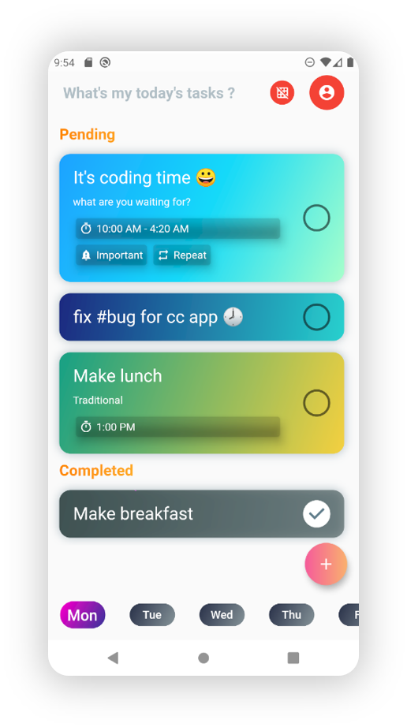

# What's my today's tasks?

A tasker with a partial gantt-style week-based project planner! Build your project faster by assigning tasks with a deadline in a week-based fashion, this makes devs more productive.

Created by [aswinmurali-io](https://github.com/aswinmurali-io/)

## Build

### Android

`flutter build apk --split-per-abi --obfuscate --split-debug-info build/debug --shrink --release --tree-shake-icons`

### iOS

`flutter build ios --split-debug-info build/debug --tree-shake-icons --obfuscate --release`

### Web

`flutter build web --tree-shake-icons --release`
`firebase deploy`

### Web Preview

`flutter run -d edge --web-hostname localhost --web-port 7357`

<https://logomakr.com/3p5e1d>
<https://logomakr.com/55Gnpe>
